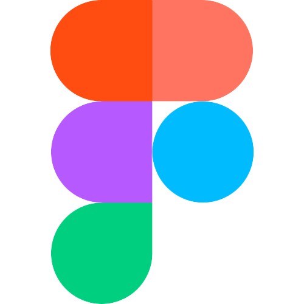

# Chorbadjiite

| Konstantin Nachev | Scrum Trainer  | 🟨 9A |

| Miroslav Markov |  Designer  | 🟨 9A |

| Aleksander Harakchiyski| Back-end developer | 🟨 9A |

| Veselin Boyanov | Front-end developer  | 🟨 9A |

## 🚀 Languages and tools:

 
         
         
         
         
         
         
        
         
</a>

